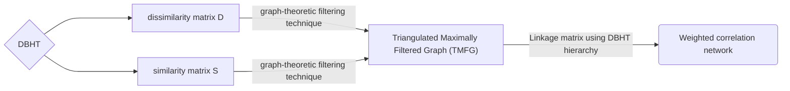

### Lucky Verma
#### luckyverma@umbc.edu
#### MK97893

# Direct Bubble Hierarchical Tree (DBHT) clustering

Our aim is to perform Direct Bubble Hierarchical Tree (DBHT) clustering, a deterministic technique which only requires a similarity matrix S, and related dissimilarity matrix D. For more information see “Hierarchical information clustering by means of topologically embedded graphs.”. This version makes extensive use of graph-theoretic filtering technique called Triangulated Maximally Filtered Graph (TMFG) for DBHT linkage and Minimum Spanning Tree (MST) for other linkage methods.

## Graph algorithms

The Planar Maximally Filtered Graph (PMFG) is a complex network which was first introduced by [Tumminello, M., Aste, T., Di Matteo, T., & Mantegna, R. N. (2005)](http://www.pnas.org/content/102/30/10421).

Its main purpose is to filter out complex networks by keeping only the main representative links. Before this paper, the main tool for this task was the Minimum Spanning Tree (MST). Its use on stocks correlation was first proposed (in `modern’ times) by Mantegna [Mantegna, R. N. (1999). Hierarchical structure in financial markets.](https://arxiv.org/pdf/cond-mat/9802256.pdf)

The fundamental difference between the PMFG and the MST is that the PMFG retains a little more information: if n is the number of nodes, the MST has n - 1 edges, whereas the PMFG has 3(n - 2) edges (as opposed to n(n-1)/2 of the entire graph K n). Furthermore, the MST is always present in the PMFG. For these reasons, the research on "complex networks in finance" is (slowly) migrating toward this technique. The lack of a freely available implementation, in contrast to the MST, which is both easier to develop and widely available in libraries, may deter some from using the PMFG (e.g. NetworkX). This is why a Python implementation of the PMFG is provided here.

A given complex system [is] composed by n elements where a similarity measure S between pairs of elements is defined, e.g., the weight of links in the original network or the correlation coefficient matrix of the system. An ordered list S_ord of pair of nodes can be constructed by arranging them in descending order according to the value of the similarity s_ij between elements i and j.

The construction algorithm for such graphs is as follows: Following the ordered list S_ord starting from the couple of elements with larger similarity, one adds an edge between element i and element j if and only if the resulting graph can still be embedded on a surface of genus g ≤ k after such edge insertion. This algorithm generates simple, undirected, connected graphs embedded on a surface of genus g = k.

The PMFG corresponds (by definition) to the case genus k = 0, i.e. the PMFG is a planar graph. This characterization provides us with a way of implementing concretely this algorithm: The Kuratowski’s theorem.
> *Kuratowski’s theorem: A finite graph is planar if and only if it does not contain a subgraph that is homeomorphic to K_5 or K_3,3.*

This creates a network plot of Planar Maximally Filtered Graph (PMFG) for DBHT linkage and Minimum Spanning Tree (MST) for linkage methods to establish the link between supplied tickers from stock market.

### Step-By-Step 

Flow for creating DBHT hierarcy.

## Reference

1. [Won-Min Song, T. Di Matteo, and Tomaso Aste. Hierarchical information clustering by means of topologically embedded graphs. PLOS ONE, 7(3):1–14, 03 2012.](https://doi.org/10.1371/journal.pone.0031929)
2. [Marcos M. López de Prado. Machine Learning for Asset Managers. Elements in Quantitative Finance. Cambridge University Press, 2020.](https://doi.org/10.1017/9781108883658)
3. [Wolfram Barfuss, Guido Previde Massara, T. Di Matteo, and Tomaso Aste. Parsimonious modeling with information filtering networks. Physical Review E, Dec 2016.](https://doi.org/10.1103/physreve.94.062306)
4. [Guido Previde Massara, T. D. Matteo, and T. Aste. Network filtering for big data: triangulated maximally filtered graph. J. Complex Networks, 5:161–178, 2017.]()
5. [Gábor J. Székely, Maria L. Rizzo, and Nail K. Bakirov. Measuring and testing dependence by correlation of distances. The Annals of Statistics, 35(6):2769 – 2794, 2007.](https://doi.org/10.1214/009053607000000505)
6. [Marcos M. López de Prado. Machine Learning for Asset Managers. Elements in Quantitative Finance. Cambridge University Press, 2020](https://doi.org/10.1017/9781108883658)